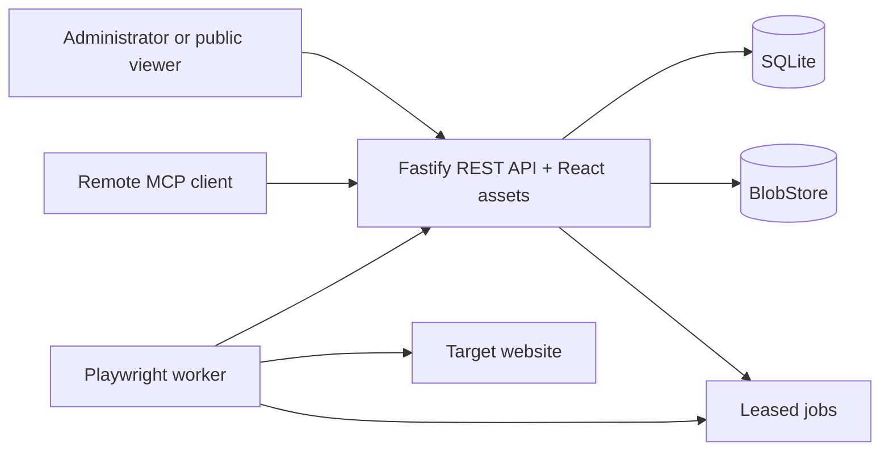

# Architecture

Screenshot-a-Day has three runtime surfaces: a browser-delivered React application, a Fastify control plane, and a stateless Playwright worker. The control plane serves both stable REST routes and an experimental stateless MCP endpoint. It owns authentication, scheduling, SQLite, and blobs. Workers lease capture or export jobs and return artifacts through an internal authenticated protocol.

REST and MCP use the same bearer-token records, scopes, project boundaries, SQLite connection, and capture queue. MCP does not add a service, port, database schema, or session store.

The deployment has no external queue. SQLite transactions serialize job claims, and leases provide crash recovery. Only `/api/v1` and versioned public routes are stable interfaces. The v0.1 `/mcp` surface is experimental, and internal worker routes may evolve in lockstep with the product version.
