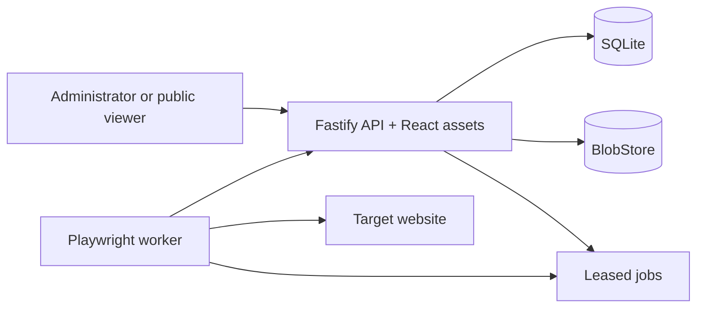

# Architecture

Screenshot-a-Day has three runtime surfaces: a browser-delivered React application, a Fastify control plane, and a stateless Playwright worker. The API owns authentication, scheduling, SQLite, and blobs. Workers lease capture or export jobs and return artifacts through an internal authenticated protocol.

The deployment has no external queue. SQLite transactions serialize job claims, and leases provide crash recovery. Only API and versioned public routes are stable interfaces; internal worker routes may evolve in lockstep with the product version.
